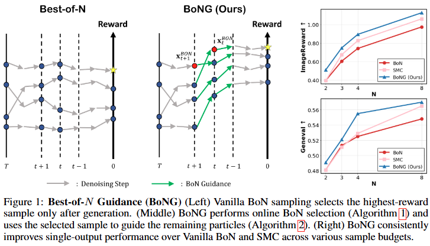
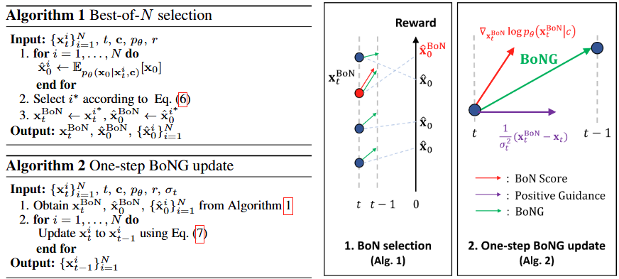

# [NeurIPS 2026] Best-of-N Guidance for Test-time Diffusion Alignment (BoNG)

**Authors: [Richard Lee Kim](https://sites.google.com/view/richard-lee-kim/), [Yeongmin Kim](https://sites.google.com/view/yeongmin-space/), Gyuwon Sim, Taekyu Kim, Minsang Park, and Il-Chul Moon**

[[Paper]](https://arxiv.org/abs/2610.05108)

## Overview

**Best-of-N Guidance (BoNG)** is a simple and efficient test-time alignment method that turns Best-of-N sampling into a guidance scheme for diffusion models. At each guided timestep, the current best particle steers the rest of the population toward high-reward regions, using one-step denoised samples in place of expensive rollouts. BoNG shows superior performance compared to prior guidance methods at a much lower computational cost, while avoiding the particle collapse of Sequential Monte Carlo (SMC).



Compared to existing test-time alignment methods, BoNG

- achieves superior performance in both single-output (BoN) and multi-output settings,
- requires no neural backward operations or additional score network evaluations,
- avoids the particle collapse of SMC.



## Installation

```bash
git clone https://github.com/aailab-kaist/BoNG.git
cd BoNG
pip install -r requirements.txt
```

The code builds on [FK-Diffusion-Steering](https://github.com/zacharyhorvitz/Fk-Diffusion-Steering) and uses [ImageReward](https://github.com/THUDM/ImageReward) as the default reward model. Prompts are taken from [GenEval](https://github.com/djghosh13/geneval) (`prompt_files/geneval_metadata.jsonl`).

## Usage

```bash
# SD v1.5, DDPM 100 steps, N = 4, window [40, 44), scale s = 6
python launch_BoNG.py --use_bong --num_particles=4 --num_inference_steps=100 \
    --bong_t_start=40 --bong_t_end=44 --bong_scale=6 --save_individual_images

# SDXL, DDPM 100 steps, N = 4, window [24, 28), scale s = 4
python launch_BoNG.py --use_bong --model_name=stabilityai/stable-diffusion-xl-base-1.0 \
    --num_particles=4 --num_inference_steps=100 \
    --bong_t_start=24 --bong_t_end=28 --bong_scale=4 --save_individual_images
```

### Key arguments

| Argument | Description | Default |
|---|---|---|
| `--num_particles` | Number of denoising particles $N$ | 4 |
| `--num_inference_steps` | Number of sampling steps | 100 |
| `--use_bong` | Enable BoNG | off |
| `--bong_t_start`, `--bong_t_end` | Guidance window; BoNG is applied on steps `[t_start, t_end)` | 40, 44 |
| `--bong_scale` | Guidance scale $s$ | 6.0 |
| `--eta` | DDIM $\eta$ (1.0 for DDPM, 0.0 for DDIM) | 1.0 |
| `--guidance_reward_fn` | Reward model used for guidance | ImageReward |
| `--model_name` | Backbone (`runwayml/stable-diffusion-v1-5`, `stabilityai/stable-diffusion-xl-base-1.0`) | SD v1.5 |

## Acknowledgements

This codebase builds upon and is inspired by:

- **Diffusers**: https://github.com/huggingface/diffusers
- **FK-Diffusion-Steering**: https://github.com/zacharyhorvitz/Fk-Diffusion-Steering
- **ImageReward**: https://github.com/THUDM/ImageReward
- **LiDAR**: https://github.com/aailab-kaist/Diffusion-LiDAR-Sampling
- **DATE**: https://github.com/aailab-kaist/DATE

## Citation

```bibtex
@article{kim2026bong,
  title={Best-of-{N} Guidance for Test-time Diffusion Alignment},
  author={Kim, Richard Lee and Kim, Yeongmin and Sim, Gyuwon and Kim, Taekyu and Park, Minsang and Moon, Il-Chul},
  journal={arXiv preprint arXiv:2610.05108},
  year={2026}
}
```

## License

This project is released under the Apache 2.0 License. See [LICENSE](./LICENSE) for details.
